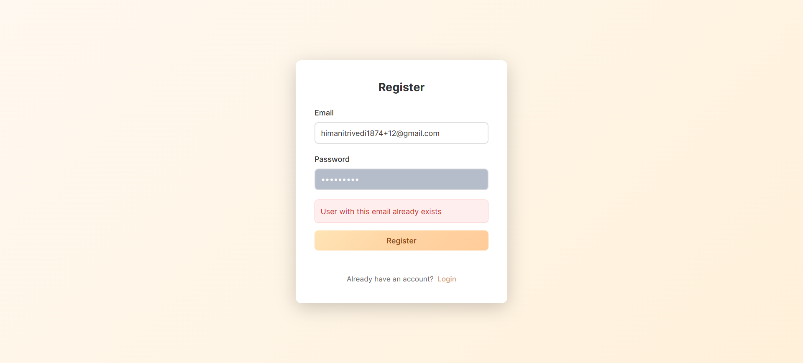
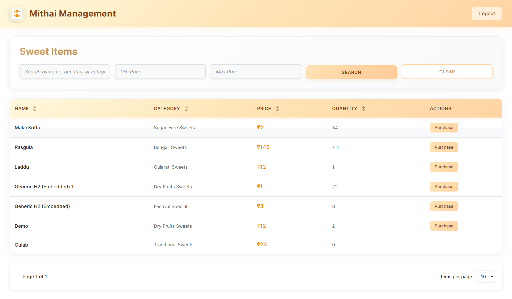
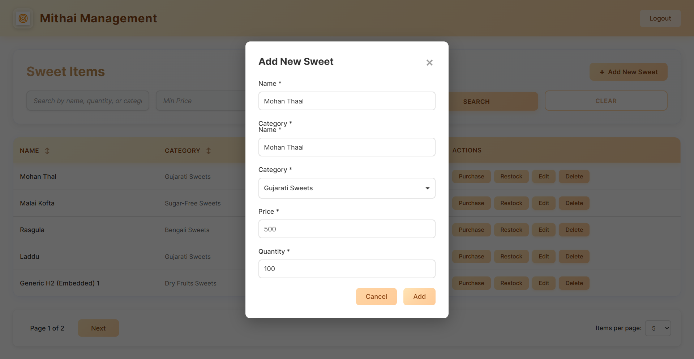
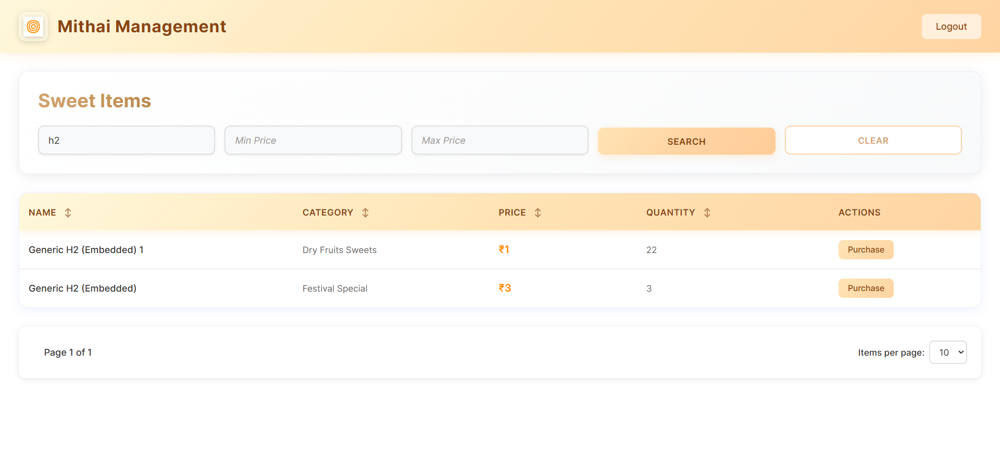
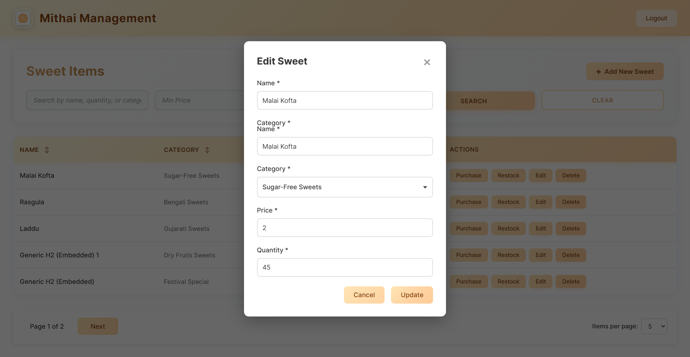
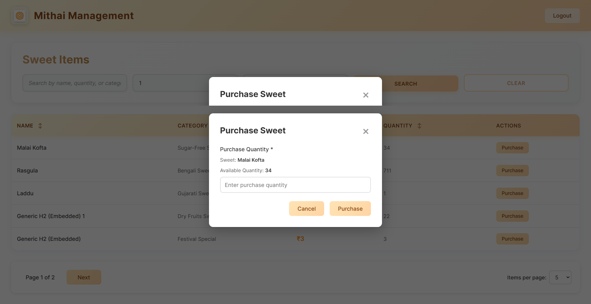
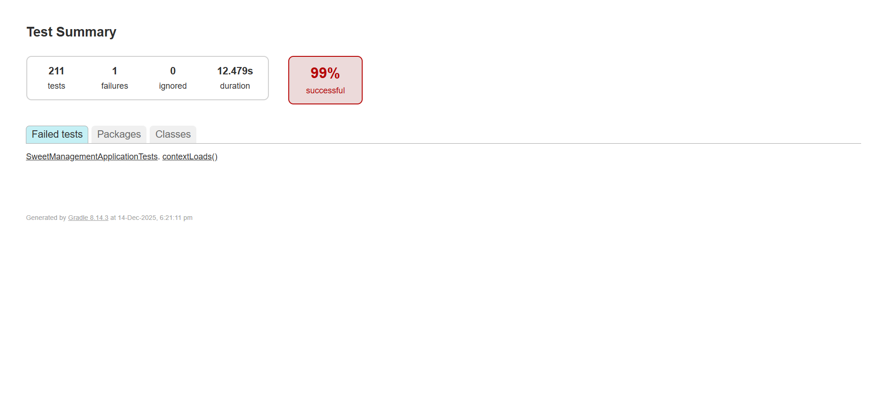

# Sweet Management System

A comprehensive Spring Boot REST API for managing a sweet shop inventory system. This application provides authentication, authorization, and full CRUD operations for managing sweets, categories, and inventory.

## 📋 Table of Contents

1. [Project Overview and Project Setup](#1-project-overview-and-project-setup)
2. [Application Screenshots](#2-application-screenshots)
3. [Test Report Screenshot](#3-test-report-screenshot)
4. [My AI Usage Section](#4-my-ai-usage-section)

---

## 1. Project Overview and Project Setup

### 🎯 Overview

Sweet Management System is a backend API built with Spring Boot that enables:
- User registration and authentication using JWT tokens
- Role-based access control (Admin and User roles)
- Complete CRUD operations for sweets
- Inventory management (purchase and restock)
- Category management
- Search and filtering capabilities
- Pagination support

### ✨ Features

#### Authentication & Authorization
- User registration with email validation
- JWT-based authentication
- Role-based access control (ADMIN, USER)
- Secure password hashing using BCrypt

#### Sweet Management
- Create, read, update, and delete sweets (Admin only)
- List all sweets with pagination
- Search sweets by name, category, or price range
- View sweet categories

#### Inventory Management
- Purchase sweets (decreases quantity) - Available to authenticated users
- Restock sweets (increases quantity) - Admin only
- Automatic quantity validation

#### Additional Features
- OpenAPI/Swagger documentation
- Global exception handling
- Standardized API responses
- CORS configuration for frontend integration
- Data initialization (admin user and categories)

### 🛠 Technology Stack

- **Java**: 21
- **Spring Boot**: 3.5.8
- **Spring Security**: JWT-based authentication
- **Spring Data JPA**: Database operations
- **PostgreSQL**: Database
- **Lombok**: Reducing boilerplate code
- **SpringDoc OpenAPI**: API documentation
- **Gradle**: Build tool
- **JUnit**: Testing framework

### 📁 Project Structure

#### Overview

The project is organized into modular packages following domain-driven design principles:

```
src/main/java/com/api/mithai/
├── auth/        # Authentication (login, register, users, roles)
├── sweet/       # Sweet management (CRUD, categories, inventory, search)
├── base/        # Common configs, constants, exception handling, responses
└── security/    # JWT security, filters, and Spring Security configuration
```

#### Module Breakdown

##### 1. **auth/** - Authentication Module
Handles user registration, login, and user management:
- **Controller**: Exposes `/api/auth/register` and `/api/auth/login` endpoints
- **Service**: Contains authentication business logic, password validation, and JWT token generation
- **Entity**: User entity with role-based access control
- **Repository**: User data access operations
- **DTOs**: Request/Response objects for authentication operations

##### 2. **sweet/** - Sweet Management Module
Core business logic for managing sweets and inventory:
- **Controllers**: 
  - `SweetController`: CRUD operations for sweets
  - `InventoryController`: Purchase and restock operations
  - `SweetCategoryController`: Category listing
- **Service**: Business logic for sweet operations, validation, and inventory management
- **Entity**: Sweet and SweetCategory entities with relationships
- **Repository**: Data access with custom queries and specifications
- **Specification**: JPA Specifications for advanced search and filtering
- **DTOs**: Data transfer objects for sweet operations

##### 3. **base/** - Common/Base Module
Shared components used across the application:
- **Config**: Application configurations, data initialization, CORS, and OpenAPI setup
- **Constants**: Application-wide constants and URL definitions
- **Exception**: Global exception handler and custom exceptions
- **Response**: Standardized response wrappers (BaseResponse, PaginatedBaseResponse)
- **Service**: Base service with common utilities

##### 4. **security/** - Security Module
JWT-based authentication and authorization:
- **JwtTokenProvider**: Token generation and validation
- **JwtAuthenticationFilter**: Filter to intercept requests and validate JWT tokens
- **SecurityConfig**: Spring Security configuration with filter chains
- **UserDetailsService**: Custom user details service for authentication
- **AccessTokenManager**: Token management utilities

### 📋 Prerequisites

Before you begin, ensure you have the following installed:

1. **Java Development Kit (JDK) 21** or higher
   - Download from [Oracle](https://www.oracle.com/java/technologies/downloads/) or [OpenJDK](https://openjdk.org/)
   - Verify installation: `java -version`

2. **PostgreSQL Database** (version 12 or higher)
   - Download from [PostgreSQL Official Site](https://www.postgresql.org/download/)
   - Create a database for the application

3. **Gradle** (optional, wrapper included)
   - The project includes Gradle wrapper (`gradlew`), so you don't need to install Gradle separately
   - If you prefer, install Gradle from [Gradle Official Site](https://gradle.org/install/)

4. **IDE** (recommended)
   - IntelliJ IDEA, Eclipse, or VS Code with Java extensions

### 🚀 Setup Instructions

#### Step 1: Clone the Repository

```bash
git clone <repository-url>
cd sweet-managment
```

#### Step 2: Set Up PostgreSQL Database

1. **Create a PostgreSQL database:**
   ```sql
   CREATE DATABASE sweet_management;
   ```

2. **Note your database credentials:**
   - Database URL
   - Username
   - Password

#### Step 3: Configure Environment Variables

Create a `.env` file in the root directory (or set environment variables):

```env
DATASOURCE_URL=jdbc:postgresql://localhost:5432/sweet_management
DATASOURCE_USERNAME=your_username
DATASOURCE_PASSWORD=your_password
```

**Note:** The application uses environment variables for database configuration. You can also modify `application.properties` directly, but using environment variables is recommended for security.

#### Step 4: Build the Project

Using Gradle Wrapper (recommended):

**Windows:**
```bash
gradlew.bat build
```

**Linux/Mac:**
```bash
./gradlew build
```

Or using installed Gradle:
```bash
gradle build
```

#### Step 5: Run the Application

**Using Gradle Wrapper:**

**Windows:**
```bash
gradlew.bat bootRun
```

**Linux/Mac:**
```bash
./gradlew bootRun
```

**Or using installed Gradle:**
```bash
gradle bootRun
```

**Or run directly from IDE:**
- Open the project in your IDE
- Run `SweetManagementApplication.java`

#### Step 6: Verify the Application

1. The application will start on port **8081** (as configured in `application.properties`)
2. Access Swagger UI at: `http://localhost:8081/swagger-ui.html`
3. The database tables will be created automatically (Hibernate DDL auto-update)

### ⚙️ Configuration

#### Application Properties

The main configuration file is located at `src/main/resources/application.properties`:

#### Environment Variables

Set these environment variables before running:

- `DATASOURCE_URL`: PostgreSQL connection URL
- `DATASOURCE_USERNAME`: Database username
- `DATASOURCE_PASSWORD`: Database password

**Windows (PowerShell):**
```powershell
$env:DATASOURCE_URL="jdbc:postgresql://localhost:5432/sweet_management"
$env:DATASOURCE_USERNAME="your_username"
$env:DATASOURCE_PASSWORD="your_password"
```

**Linux/Mac:**
```bash
export DATASOURCE_URL="jdbc:postgresql://localhost:5432/sweet_management"
export DATASOURCE_USERNAME="your_username"
export DATASOURCE_PASSWORD="your_password"
```

### 📚 API Documentation

Once the application is running, access the interactive API documentation:

- **Swagger UI**: `http://localhost:8081/swagger-ui.html`
- **OpenAPI JSON**: `http://localhost:8081/v3/api-docs`

#### API Endpoints Overview

##### Authentication (`/api/auth`)
- `POST /api/auth/register` - Register a new user
- `POST /api/auth/login` - Login and get JWT token

##### Sweets Management (`/api/sweets`)
- `POST /api/sweets` - Create a new sweet (Admin only)
- `GET /api/sweets` - List all sweets with pagination (Authenticated)
- `GET /api/sweets/search` - Search sweets (Authenticated)
- `PUT /api/sweets/{id}` - Update a sweet (Admin only)
- `DELETE /api/sweets/{id}` - Delete a sweet (Admin only)

##### Inventory Management (`/api/sweets`)
- `POST /api/sweets/{id}/purchase` - Purchase a sweet (Authenticated)
- `POST /api/sweets/{id}/restock` - Restock a sweet (Admin only)

##### Categories (`/api/sweets/category`)
- `GET /api/sweets/category` - Get all categories (Authenticated)

### 🔐 Authentication & Authorization

#### Overview

The application implements a stateless JWT-based authentication system. Authentication flow involves:
1. User registration with email validation and password hashing
2. Login to receive a JWT access token
3. Token validation on protected endpoints
4. Role-based authorization for different operations

**Security Features:**
- BCrypt password hashing (10 rounds)
- JWT tokens with expiration (4 hours default)
- Stateless authentication (no server-side sessions)
- Role-based access control (RBAC)
- CORS configuration for frontend integration

#### User Roles

1. **ADMIN**: Full access to all endpoints
   - Create, update, delete sweets
   - Restock inventory
   - View all data

2. **USER**: Limited access
   - View sweets and categories
   - Purchase sweets
   - Cannot modify inventory

#### Authentication Flow

1. **Register**: Create a new account
2. **Login**: Get JWT token
   Response includes `accessToken` in the response body.
3. **Use Token**: Include in Authorization header
   ```
   Authorization: Bearer <your-jwt-token>
   ```

#### Default Admin User

On first startup, the application automatically creates an admin user:
- **Email**: `himanitrivedi1874@gmail.com`
- **Password**: `Admin@123`
- **Role**: ADMIN

**⚠️ Important**: From register endpoint will be adding new users only not admin user

### 🗄️ Database Schema

#### Overview

The application uses PostgreSQL as the relational database with three main entities:
- **Users**: Stores user accounts with authentication information
- **Sweets**: Product catalog with inventory quantities
- **SweetCategories**: Category classification for sweets

**Database Features:**
- Automatic schema generation via Hibernate DDL auto-update
- Unique constraints on email and category names
- Enum types for user roles
- Indexed fields for performance

#### Initial Data

On startup, the application initializes:
- 1 Admin user (if not exists)
- 10 Sweet categories:
  - Milk Sweets
  - Dry Fruits Sweets
  - Traditional Sweets
  - Modern Sweets
  - Sugar-Free Sweets
  - Festival Special
  - Bengali Sweets
  - Gujarati Sweets
  - Rajasthani Sweets
  - South Indian Sweets

### 🧪 Testing

#### Test Structure

The project follows Test-Driven Development (TDD) principles with comprehensive test coverage:

**Test Types:**
- **Controller Tests**: Integration tests verifying API endpoints, request/response handling, and security filters
- **Service Tests**: Unit tests for business logic, validation, and data transformations
- **Domain Tests**: Entity validation tests ensuring data integrity and business rules

**Testing Approach:**
- Tests are organized mirroring the main source structure
- Uses Spring Boot Test framework for integration testing
- MockMvc for controller testing
- JUnit 5 for test execution
- Spring Security Test for authentication testing

Tests are located in `src/test/java/com/api/mithai/`:

- **Controller Tests**: Integration tests for API endpoints
- **Service Tests**: Unit tests for business logic
- **Domain Tests**: Entity validation tests

### 🌐 Frontend Integration

**Frontend Repository:**
- **Frontend Repo**: [sweet-application](https://github.com/Himani-Trivedi/sweet-application)

#### CORS Configuration

The application is configured to allow requests from `http://localhost:5173` (default Vite port). To change this, update `app.frontend.allowed.origin` in `application.properties`.

### 📝 Additional Notes

#### Password Requirements

Passwords are validated with the following rules:
- Minimum length requirements
- Must contain uppercase, lowercase, numbers, and special characters

#### JWT Token Expiration

Default JWT token expiration is set to 4 hours (14400000 ms). This can be configured in `application.properties`.

#### Logging

The application uses SLF4J for logging. Logs are output to the console by default.

---

## 2. Application Screenshots

### Authentication APIs

#### 1. User Registration (`POST /api/auth/register`)
Register a new user account with validation.



#### 2. User Login (`POST /api/auth/login`)
Login page to authenticate users.


**Login as Admin:**


**Login as User:**


### Sweets Management APIs

#### 3. Create Sweet (`POST /api/sweets`)
Add a new sweet to the inventory (Admin only).



#### 4. Search Sweets (`GET /api/sweets/search`)
Search and filter sweets by name, category, or price range.



#### 5. Update Sweet (`PUT /api/sweets/{id}`)
Edit and update sweet details (Admin only).



### Inventory Management APIs

#### 6. Purchase Sweet (`POST /api/sweets/{id}/purchase`)
Purchase a sweet, decreasing its quantity (Authenticated users).



#### 7. Restock Sweet (`POST /api/sweets/{id}/restock`)
Restock a sweet, increasing its quantity (Admin only).


---

## 3. Test Report Screenshot

The following screenshot shows the test execution report for the Sweet Management System, demonstrating comprehensive test coverage across controllers, services, and domain entities.



---

## 4. My AI Usage Section

### AI Tools Used
- ChatGPT
- Cursor
- Claude

---

### How I Used AI

#### ChatGPT
I used ChatGPT primarily as a learning and validation tool:
- To understand the Test-Driven Development (TDD) workflow and identify appropriate test cases.
- To debug errors and understand the root causes of issues.
- To learn new concepts related to Spring Boot, security, and frontend-backend integration.
- To validate implementation approaches before coding.
- To understand React project creation and recommended folder structure, as I come from a backend development background.
- To find optimized and cleaner code snippets.
- To refactor and improve Git commit messages.

#### Cursor
I used Cursor as an AI-assisted development tool:
- To generate unit and integration test cases.
- To apply consistent changes across multiple files efficiently.
- To fix issues directly from error logs and warnings.
- To assist in integrating the React frontend with backend APIs.
- To generate boilerplate code for API-based frontend components.
- To identify and resolve common issues such as CORS configuration, API response handling, and authentication errors.
- To accelerate frontend development by generating initial React components based on my prompts, which I then reviewed, modified, and refined according to project requirements.

---

### Reflection on AI Impact

AI significantly improved my development workflow in the following ways:
- Enabled faster learning and deeper understanding of concepts.
- Reduced time spent writing repetitive or boilerplate code.
- Helped explore multiple implementation ideas and architectural approaches.
- Assisted in identifying optimized solutions for various scenarios.
- Made it possible for me to independently build a React frontend application despite not having prior hands-on experience with React.

Although I was new to React, I clearly understood the backend logic, API flows, authentication handling, and error scenarios. Using AI, I was able to translate that understanding into a working frontend by guiding the tool with precise requirements and validating each implementation.

Overall, AI allowed me to focus more on problem-solving, system design, and correctness, while still maintaining full ownership of the final codebase. All AI-generated outputs were carefully reviewed, tested, and customized to meet project needs.

---

## 👤 Author

**Himani Trivedi**
- Email: himanitrivedi1874@gmail.com

---
